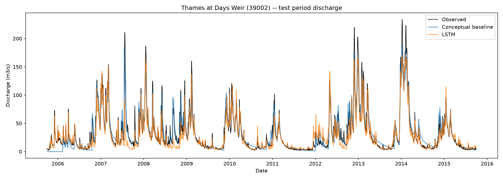
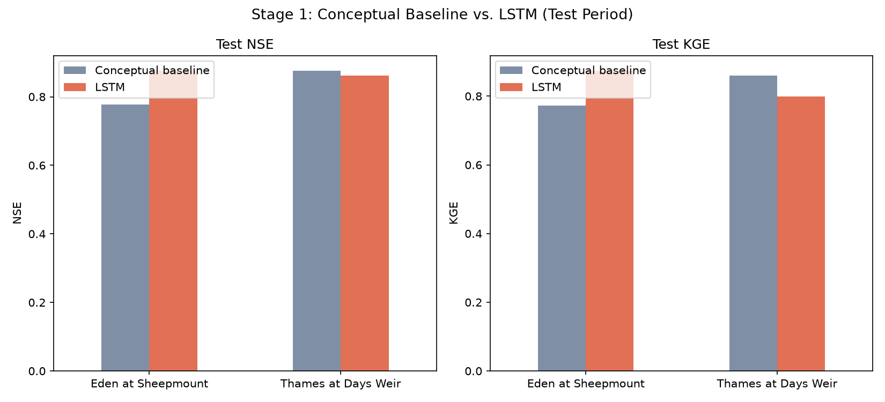
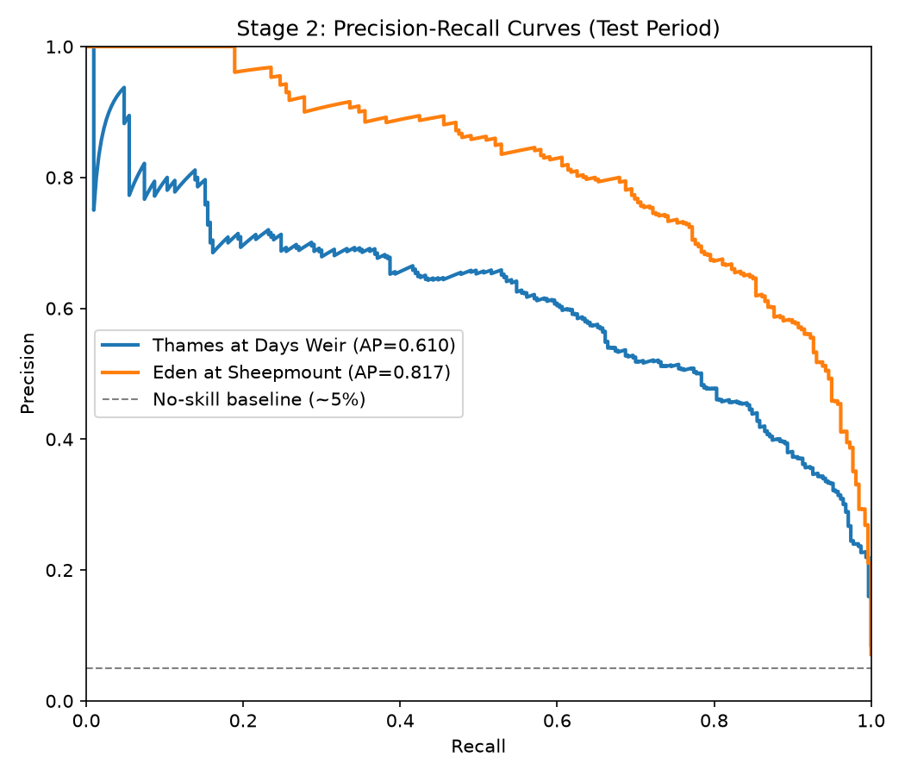
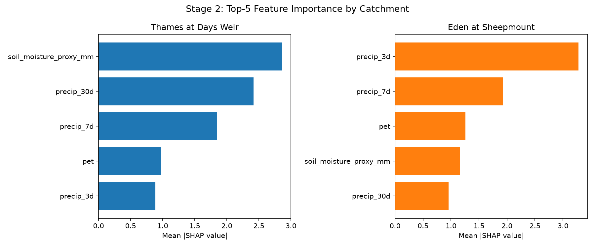
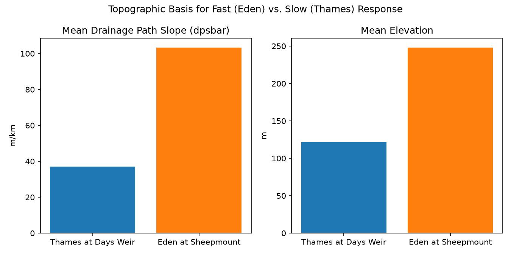

# UK Catchment Flood & Water Security Toolkit


An integrated rainfall-runoff forecasting, explainable flood-risk classification, and geospatial risk overlay pipeline for two UK catchments, chaining forecasting and risk assessment for the same drainage basins.

## Problem

Most flood tools address either forecasting (predicting flow from rainfall) or risk assessment (identifying vulnerable areas) in isolation. This toolkit chains both together: a rainfall-runoff forecaster benchmarked against a physically-based conceptual model, an explainable flood-risk classifier, and a geospatial overlay combining flood risk with infrastructure and water-stress data.

## Catchments

| Role | Catchment | NRFA ID | Catchment area | Record |
|---|---|---|---|---|
| Primary | Thames at Days Weir | 39002 | 3,444.7 km² | 1970–2015 |
| Secondary | Eden at Sheepmount | 76007 | 2,286.5 km² | 1970–2015 |

Selected for contrasting hydrological regimes: a large, low-gradient lowland catchment (Thames) and a smaller, steep upland catchment with a record UK flood event (Eden, Storm Desmond 2015).

## Pipeline

**Stage 1 — Rainfall-Runoff Forecasting**
A 3-store linear-reservoir conceptual model (calibrated via differential evolution) benchmarked against an LSTM (365-day lookback, precipitation/PET/temperature → next-day discharge). Both evaluated on an identical held-out test period (2005–2015) using NSE and KGE. All LSTM training is seeded and verified bit-for-bit reproducible across repeated runs.

<p align="center">
  <br>
  <em>Thames test-period discharge: observed vs. conceptual baseline vs. LSTM</em>
</p>

<p align="center">
  <br>
  <em>NSE / KGE, conceptual baseline vs. LSTM, both catchments</em>
</p>

**Stage 2 — Explainable Flood Risk Classification**
Binary flood-day classification (XGBoost) using antecedent precipitation, PET, a soil-moisture proxy reused from Stage 1's calibrated model, and static catchment attributes. Features are deliberately restricted to information independent of the discharge record used for the label, to avoid leakage. SHAP explainability included.

<p align="center">
  <br>
  <em>Precision-recall curves, test period (accuracy is misleading under ~5% class imbalance)</em>
</p>

<p align="center">
  <br>
  <em>Top-5 SHAP feature importance, Thames vs. Eden</em>
</p>

<p align="center">
  <br>
  <em>Topographic basis for the SHAP timescale split: drainage slope and elevation, both catchments</em>
</p>

**Stage 3 — Geospatial Risk Overlay** *(Thames only)*
Combines Stage 2's flood-risk output with OpenStreetMap infrastructure (major roads, critical amenities) and Sentinel-2 NDWI (via Google Earth Engine), rendered as an interactive map (`results/stage3_geospatial_overlay/risk_overlay_39002.html`).

## Key findings

- **Model performance is catchment-dependent, not uniform.** The LSTM outperforms the conceptual baseline on Eden (test NSE 0.877 vs. 0.777) but the baseline holds its own on Thames (0.876 vs. 0.861) — a large, slow-responding catchment does not automatically reward the LSTM's extra capacity.
- **SHAP feature rankings recover real hydrological response time directly from data.** Thames' classifier is driven by 30-day soil-moisture/precipitation signals; Eden's is driven by 3-day precipitation — consistent with Thames' low gradient (mean drainage path slope ≈ 37 m/km) versus Eden's steep upland terrain (≈ 103 m/km), despite the model never being given slope or elevation as a label.
- **Critical infrastructure in the Thames catchment is heavily concentrated around Oxford**, with limited coverage in the western/Cotswolds area — a genuine feature of the data, not a sampling artifact.

## Scope and limitations

- Stage 3's flood-risk layer is a **catchment-wide scalar**, not a spatially-distributed prediction. Genuine spatial risk variation would require gridded meteorological inputs and a distributed soil-moisture product, neither in scope here.
- Uses **CAMELS-GB v1** (record ending 2015-09-30), not the extended v2 dataset.
- Stage 3's water-stress layer (NDWI) reflects current Sentinel-2 imagery, while the flood-risk score reflects the 2015 test period — two distinct time snapshots, clearly labeled as such on the map rather than implied to be simultaneous.
- Findings are demonstrated for two catchments; generalizing to other UK catchments would require further validation.

## Repository structure

data/ # CAMELS-GB, OSM, NDWI, Stage 2 feature tables
models/ # Checkpointed baseline params, LSTM weights, XGBoost models
notebooks/ # Integrated pipeline notebook
results/ # Figures, maps, summary visualizations
src/
stage1_lstm_forecast/ # Conceptual baseline, LSTM, evaluation
stage2_risk_classifier/ # Feature engineering, XGBoost, SHAP
stage3_geospatial_overlay/ # Catchment boundary, OSM, NDWI, risk overlay map


## Setup

```bash
python3.11 -m venv .venv-flood
source .venv-flood/bin/activate
pip install -r requirements.txt
```

Requires a free CEH/EIDC account for CAMELS-GB, and a registered Google Cloud project for Earth Engine access (Stage 3 NDWI only).

## Data sources

- [CAMELS-GB](https://catalogue.ceh.ac.uk/id/8344e4f3-d2ea-44f5-8afa-86d2987543a9) (Coxon et al., 2020) — UK Centre for Ecology & Hydrology, Open Government Licence
- [UK National River Flow Archive](https://nrfa.ceh.ac.uk/) — station metadata
- OpenStreetMap contributors — infrastructure data via Overpass API
- Sentinel-2 L2A (Copernicus) — via Google Earth Engine
